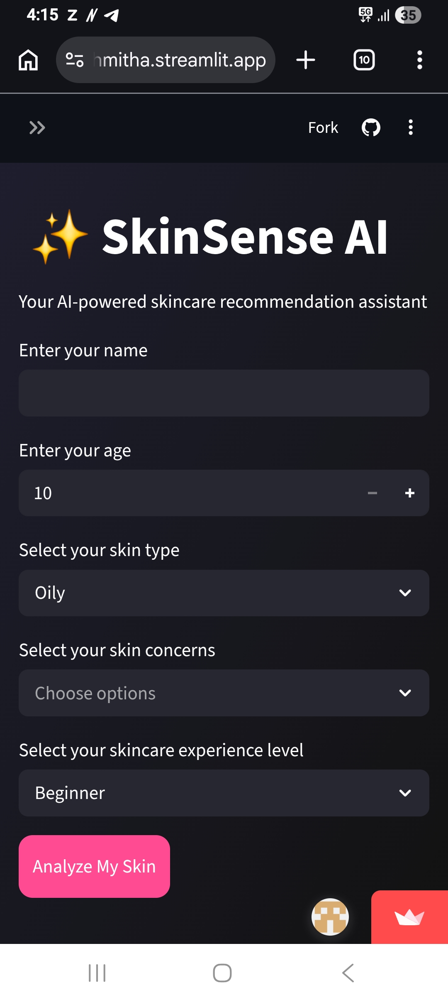
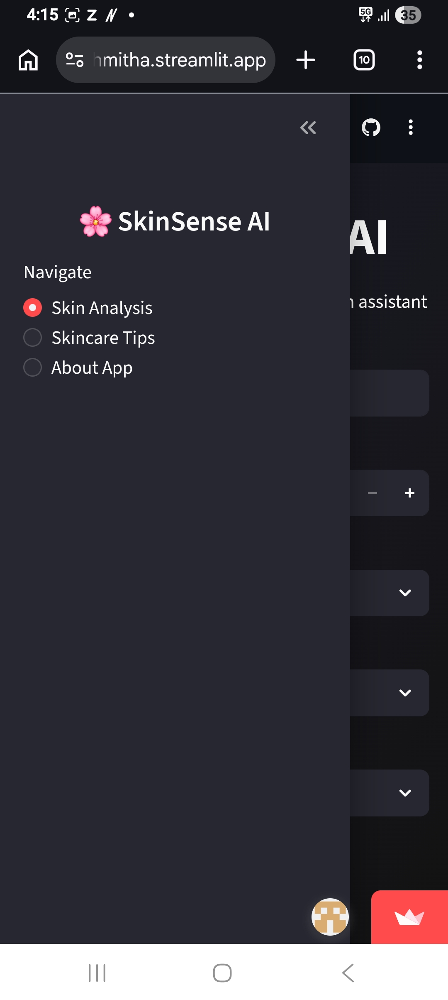
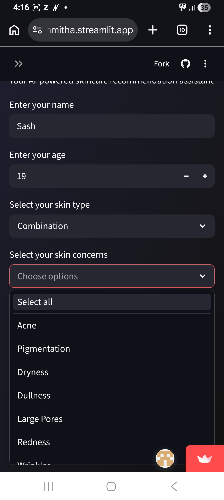
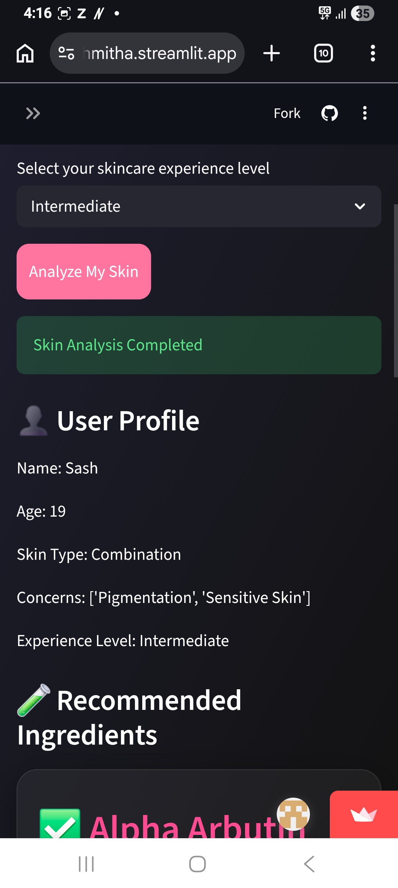
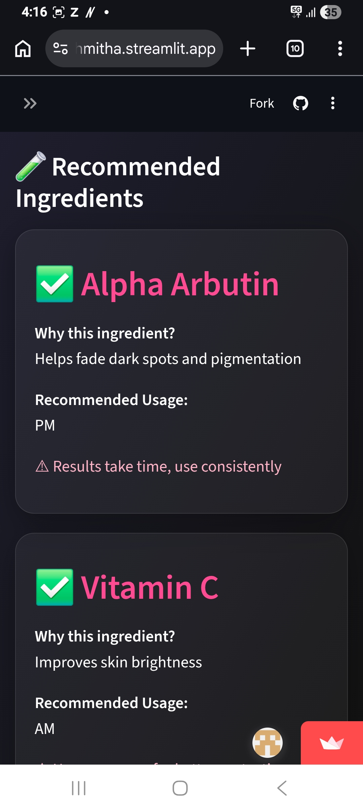
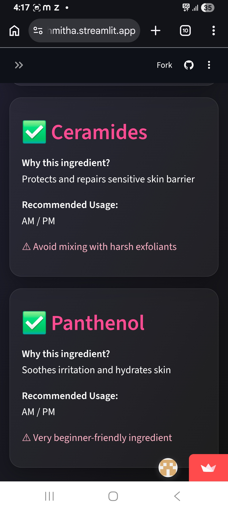
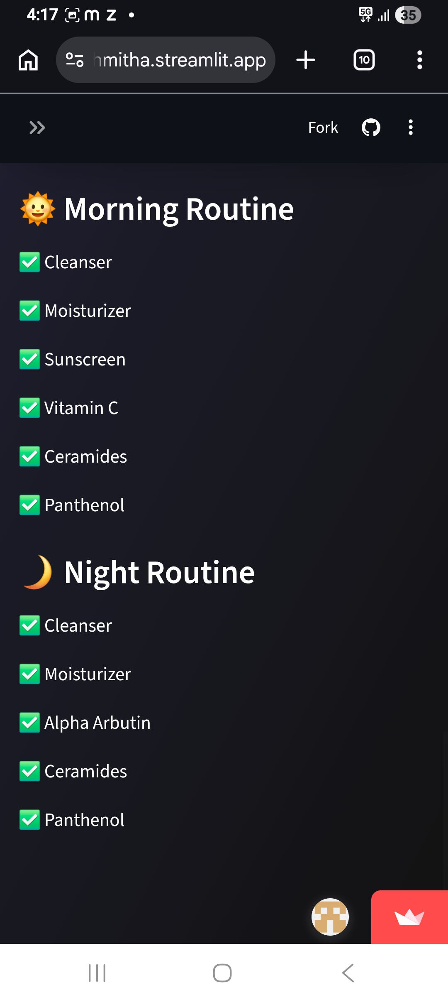
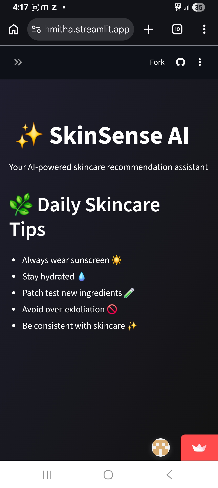
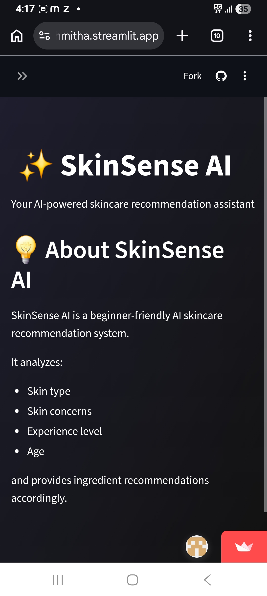

<h1 align="center">🧴 SkinSense AI</h1>
<h3 align="center">AI-Powered Skincare Recommendation System</h3>

  
  
  
  

  

---

## 📸 Screenshots

---

## ✨ Project Highlights
- 🚀 Fully deployed AI web app using Streamlit
- 🧠 Rule-based recommendation system for skincare
- 📊 Personalized suggestions based on skin type & concerns
- 🌐 Live accessible web application
- 💡 Beginner-friendly AI/ML project implementation

---

## ⚙️ How It Works
- User selects skin type (oily/dry/combination/sensitive/normal)
- User selects skin concerns (acne, dryness, pigmentation, etc.)
- System applies rule-based logic
- Recommended skincare ingredients are displayed

---

## 🛠️ Tech Stack

![NumPy](https://img.shields.io/badge/NumPy-013243?style=for-the-badge&logo=numpy&logoColor=w

To build a simple AI-based recommendation system that demonstrates real-world application of rule-based logic in skincare personalization.
